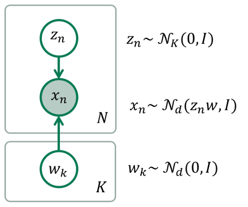

.. image:: https://badge.fury.io/gh/PGM-Lab%2Finferpy.svg
    :target: https://badge.fury.io/gh/PGM-Lab%2Finferpy

.. image:: https://travis-ci.org/PGM-Lab/InferPy.svg?branch=master
    :target: https://travis-ci.org/PGM-Lab/InferPy

.. image:: https://img.shields.io/badge/License-Apache%202.0-blue.svg
    :target: https://opensource.org/licenses/Apache-2.0

.. image:: docs/_static/img/logo.png
   	:scale: 90 %
   	:align: center

InferPy: Deep Probabilistic Modeling Made Easy
===============================================

InferPy is a high-level API for probabilistic modeling written in Python and 
capable of running on top of Edward and Tensorflow. InferPy's API is 
strongly inspired by Keras and it has a focus on enabling flexible data processing, 
easy-to-code probablistic modeling, scalable inference and robust model validation.

Use InferPy is you need a probabilistic programming language that:

* Allows easy and fast prototyping of hierarchical probabilistic models with a simple and user friendly API inspired by Keras. 
* Defines probabilistic models with complex probabilistic constructs containing deep neural networks.   
* Automatically creates computational efficient batched models without the need to deal with complex tensor operations.
* Run seamlessly on CPU and GPU by relying on Tensorflow. 

.. * Process seamlessly small data sets stored on a Panda's data-frame, or large distributed data sets by relying on Apache Spark.

InferPy is to Edward what Keras is to Tensorflow
-------------------------------------------------
InferPy's aim is to be to Edward what Keras is to Tensorflow. Edward is a general purpose
probabilistic programing language, like Tensorflow is a general computational engine. 
But this generality comes a at price. Edward's API is
verbose and is based on distributions over Tensor objects, which are n-dimensional arrays with 
complex semantics operations. Probability distributions over Tensors are powerful abstractions 
but it is not easy to operate with them. InferPy's API is no so general like Edward's API 
but still covers a wide range of powerful and widely used probabilistic models, which can contain
complex probability constructs containing deep neural networks.  

Getting Started:
================

Installation
-----------------

Install InferPy from PyPI:

.. code:: bash

   $ python -m pip install inferpy

30 seconds to InferPy
--------------------------

The core data structures of InferPy is a **probabilistic model**,
defined as a set of **random variables** with a conditional dependency
structure. A **random varible** is an object
parameterized by a set of Numpy's arrays.

Let's look at a simple (Bayesian) **probabilistic component analysis** model. Graphically the model can
be defined as follows,

   Bayesian PCA

We start defining the **prior** of the global parameters,

.. code-block:: python

    import inferpy as inf
    from inferpy.models import Normal

    # K defines the number of components.
    K=10

    # d defines the number of dimensions
    d=20

    #Prior for the principal components
    with inf.replicate(size = K):
        w = Normal(loc = 0, scale = 1, dim = d)  # x.shape = [K,d]

    # Number of observations (data)
    N = 1000

    # define the generative model
    with inf.replicate(size=N):
        z = Normal(0, 1, dim=K)  # z.shape = [N,K]
        x = Normal(inf.matmul(z,w), 1.0, observed=True, dim=d)  # x.shape = [N,d]

InferPy supports the definition of **plateau notation** by using the
construct ``with inf.replicate(size = K)``, which replicates K times the
random variables enclosed within this anotator. Every replicated
variable is assumed to be **independent**. This ``with inf.replicate(size = N)`` construct is also useful when
defining the model for the data.

As commented above, the variables are surrounded by a
``with`` statement to inidicate that the defined random variables will
be reapeatedly used in each data sample. In this case, every replicated
variable is conditionally idependent given the variable :math:`\mathbf{w}`
defined above.

Once the random variables of the model are defined, the probablitic
model itself can be created and compiled. The probabilistic model
defines a joint probability distribuiton over all these random
variables. Finally, you can fit your model with a given data set:

.. code-block:: python

    # compile and fit the model with training data
    pca.compile()
    pca.fit(data)

    #extract the hidden representation from a set of observations
    hidden_encoding = pca.posterior(z)

