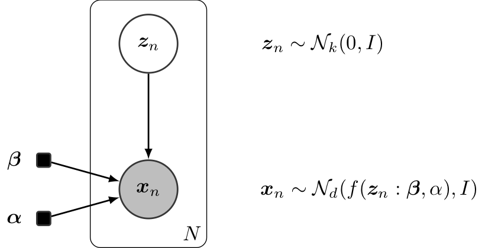

.. image:: https://badge.fury.io/gh/PGM-Lab%2Finferpy.svg
    :target: https://badge.fury.io/gh/PGM-Lab%2Finferpy

.. image:: https://travis-ci.org/PGM-Lab/InferPy.svg?branch=master
    :target: https://travis-ci.org/PGM-Lab/InferPy

.. image:: https://img.shields.io/badge/License-Apache%202.0-blue.svg
    :target: https://opensource.org/licenses/Apache-2.0

.. image:: docs/_static/img/logo.png
   	:scale: 90 %
   	:align: center

InferPy: Deep Probabilistic Modeling Made Easy
===============================================

InferPy is a high-level API for probabilistic modeling written in Python and 
capable of running on top of Edward and Tensorflow. InferPy's API is 
strongly inspired by Keras and it has a focus on enabling flexible data processing, 
easy-to-code probablistic modeling, scalable inference and robust model validation.

Use InferPy is you need a probabilistic programming language that:

* Allows easy and fast prototyping of hierarchical probabilistic models with a simple and user friendly API inspired by Keras. 
* Defines probabilistic models with complex probabilistic constructs containing deep neural networks.   
* Automatically creates computational efficient batched models without the need to deal with complex tensor operations.
* Run seamlessly on CPU and GPU by relying on Tensorflow. 

.. * Process seamlessly small data sets stored on a Panda's data-frame, or large distributed data sets by relying on Apache Spark.

InferPy is to Edward what Keras is to Tensorflow
-------------------------------------------------
InferPy's aim is to be to Edward what Keras is to Tensorflow. Edward is a general purpose
probabilistic programing language, like Tensorflow is a general computational engine. 
But this generality comes a at price. Edward's API is
verbose and is based on distributions over Tensor objects, which are n-dimensional arrays with 
complex semantics operations. Probability distributions over Tensors are powerful abstractions 
but it is not easy to operate with them. InferPy's API is no so general like Edward's API 
but still covers a wide range of powerful and widely used probabilistic models, which can contain
complex probability constructs containing deep neural networks.  

Getting Started:
================

Installation
-----------------

Install InferPy from PyPI:

.. code:: bash

   $ python -m pip install inferpy

30 seconds to InferPy
--------------------------

The core data structures of InferPy is a **probabilistic model**,
defined as a set of **random variables** with a conditional dependency
structure. A **random varible** is an object
parameterized by a set of tensors.

Let's look at a simple non-linear **probabilistic component analysis** model (NLPCA). Graphically the model can
be defined as follows,

   Non-linear PCA

We start by importing the required packages and defining the constant parameters in the model.

.. code-block:: python

    import inferpy as inf
    import tensorflow as tf

    # number of components
    k = 1
    # size of the hidden layer in the NN
    d0 = 100
    # dimensionality of the data
    dx = 2
    # number of observations (dataset size)
    N = 1000

A model can be defined by decorating any function with ``@inf.probmodel``. The model is fully specified by
the variables defined inside this function:

.. code-block:: python

    @inf.probmodel
    def nlpca(k, d0, dx, decoder):

        with inf.datamodel():
            z = inf.Normal(tf.ones([k])*0.5, 1., name="z")    # shape = [N,k]
            output = decoder(z,d0,dx)
            x_loc = output[:,:dx]
            x_scale = tf.nn.softmax(output[:,dx:])
            x = inf.Normal(x_loc, x_scale, name="x")   # shape = [N,d]

The construct ``with inf.datamodel()``, which resembles to the **plateau notation**, will replicate
N times the variables enclosed, where N is the size of our data.

In the previous model, the input argument ``decoder`` must be a function implementing a neural network.
This might be defined outside the model as follows.

.. code-block:: python

    def decoder(z,d0,dx):
        h0 = tf.layers.dense(z, d0, tf.nn.relu)
        return tf.layers.dense(h0, 2 * dx)

Now, we can instantiate our model and obtain samples (from the prior distributions).

.. code-block:: python

    # create an instance of the model
    m = nlpca(k,d0,dx, decoder)

    # Sample from priors
    samples = m.sample()

In variational inference, we must defined a Q-model as follows.

.. code-block:: python

    @inf.probmodel
    def qmodel(k):
        with inf.datamodel():
            qz_loc = inf.Parameter(tf.ones([k])*0.5, name="qz_loc")
            qz_scale = tf.math.softplus(inf.Parameter(tf.ones([k]),name="qz_scale"))

            qz = inf.Normal(qz_loc, qz_scale, name="z")

Afterwards, we define the parameters of our inference algorithm and fit the data to the model.

.. code-block:: python

    # set the inference algorithm
    VI = inf.inference.VI(qmodel(k), epochs=5000)

    # learn the parameters
    m.fit({"x": x_train}, VI)

The inference method can be further configure. But, as in Keras, a core
principle is to try make things reasonably simple, while allowing the
user the full control if needed.

Finally, we might extract the posterior of ``z``, which is basically the hidden representation
of our data.

.. code-block:: python

    #extract the hidden representation
    hidden_encoding = m.posterior["z"]
    print(hidden_encoding.sample())