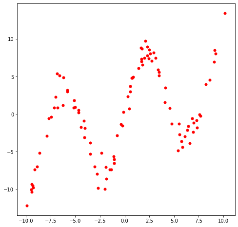
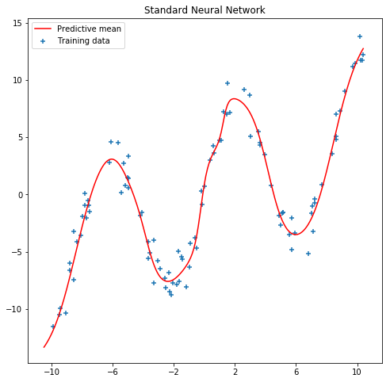

Bayesian Neural Networks
========================

Neural networks are powerful approximators. However, standard approaches
for learning this approximators does not take into account the inherent
uncertainty we may have when fitting a model.

.. code:: python3

    import logging, os
    logging.disable(logging.WARNING)
    os.environ["TF_CPP_MIN_LOG_LEVEL"] = "3"
    import matplotlib.pyplot as plt
    import numpy as np
    import tensorflow as tf
    import math
    import inferpy as inf
    import tensorflow_probability as tfp

Data
----

We use some fake data. As neural nets of even one hidden layer can be
universal function approximators, we can see if we can train a simple
neural network to fit a noisy sinusoidal data, like this:

.. code:: python3

    NSAMPLE = 100
    x_train = np.float32(np.random.uniform(-10.5, 10.5, (1, NSAMPLE))).T
    r_train = np.float32(np.random.normal(size=(NSAMPLE,1),scale=1.0))
    y_train = np.float32(np.sin(0.75*x_train)*7.0+x_train*0.5+r_train*1.0)

    plt.figure(figsize=(8, 8))
    plt.scatter(x_train, y_train, marker='+', label='Training data')
    plt.legend();

Learning Standard Neural Networks
---------------------------------

We employ a simple feedforward network with 20 hidden units to learn the
model.

.. code:: python3

    NHIDDEN = 20

    nnetwork = tf.keras.Sequential([
        tf.keras.layers.Dense(NHIDDEN, activation=tf.nn.tanh),
        tf.keras.layers.Dense(1)
    ])

    lossfunc = lambda y_out, y: tf.nn.l2_loss(y_out-y)

    nnetwork.compile(tf.train.AdamOptimizer(0.01), lossfunc)
    nnetwork.fit(x=x_train, y=y_train, epochs=1000)

.. parsed-literal::

    Epoch 1/1000
    100/100 [==============================] - 0s 2ms/sample - loss: 369.0472
    Epoch 2/1000
    100/100 [==============================] - 0s 110us/sample - loss: 333.4858
    Epoch 3/1000
    100/100 [==============================] - 0s 58us/sample - loss: 339.3102
	[...]
    Epoch 997/1000
    100/100 [==============================] - 0s 52us/sample - loss: 78.6340
    Epoch 998/1000
    100/100 [==============================] - 0s 50us/sample - loss: 78.3568
    Epoch 999/1000
    100/100 [==============================] - 0s 37us/sample - loss: 78.4461
    Epoch 1000/1000
    100/100 [==============================] - 0s 49us/sample - loss: 76.3849

.. parsed-literal::

    <tensorflow.python.keras.callbacks.History at 0x139726668>

We see that the neural network can fit this sinusoidal data quite well,
as expected.

.. code:: python3

    sess = tf.keras.backend.get_session()
    x_test = np.float32(np.arange(-10.5,10.5,0.1))
    x_test = x_test.reshape(x_test.size,1)
    y_test = sess.run(nnetwork(x_test))

    plt.figure(figsize=(8, 8))
    plt.plot(x_test, y_test, 'r-', label='Predictive mean');
    plt.scatter(x_train, y_train, marker='+', label='Training data')
    plt.xticks(np.arange(-10., 10.5, 4))
    plt.title('Standard Neural Network')
    plt.legend();

However, the model uncertainty is not appropriately captured. For
example, when making predictions about a single point (e.g. around
x=2.0), we can see we do not have into account the inherent noise there
is in the prediction. In the next section, we will what happen when we
introduce a Bayesian approach using InferPy.

Learning Bayesian Neural Networks
---------------------------------

`Bayesian
modeling <http://mlg.eng.cam.ac.uk/zoubin/papers/NatureReprint15.pdf>`__
offers a systematic framework for reasoning about model uncertainty.
Instead of just learning point estimates, we’re going to learn a
distribution over variables that are consistent with the observed data.

In Bayesian learning, the weights of the network are
``random variables``. The output of the nework is another
``random variable`` which is the one that implicitlyl defines the
``loss function``. So, when making Bayesian learning we do not define
``loss functions``, we do define ``random variables``. For more
information you can check `this
talk <https://www.cs.ox.ac.uk/people/yarin.gal/website/PDFs/2017_OReilly_talk.pdf>`__
and this `paper <https://arxiv.org/abs/1908.03442>`__.

In `Inferpy <https://inferpy.readthedocs.io>`__, defining a Bayesian
neural network is quite straightforward. First we define the neural
network using ``inf.layers.Sequential`` and layers of class
``tfp.layers.DenseFlipout``. Second, the input ``x`` and output ``y``
are also defined as random variables. More precisely, the output ``y``
is defined as a Gaussian random varible. The mean of the Gaussian is the
output of the neural network.

.. code:: python3

    @inf.probmodel
    def model(NHIDDEN):

        with inf.datamodel():
            x = inf.Normal(loc = tf.zeros([1]), scale = 1.0, name="x")

            nnetwork = inf.layers.Sequential([
                tfp.layers.DenseFlipout(NHIDDEN, activation=tf.nn.tanh),
                tfp.layers.DenseFlipout(1)
            ])

            y = inf.Normal(loc = nnetwork(x) , scale= 1., name="y")

To perform Bayesian learning, we resort to the scalable variational
methods available in InferPy, which require the definition of a ``q``
model. For details, see the documentation about `Inference in
Inferpy <https://inferpy.readthedocs.io/projects/develop/en/develop/notes/guideinference.html>`__.
For a deeper theoretical despcription, read this
`paper <https://arxiv.org/abs/1908.03442>`__. In this case, the q
variables approximating the NN are defined in a transparent manner. For
that reason we define an empty q model.

.. code:: python3

    @inf.probmodel
    def qmodel():
        pass

.. code:: python3

    NHIDDEN=20

    p = model(NHIDDEN)
    q = qmodel()

    VI = inf.inference.VI(q, optimizer = tf.train.AdamOptimizer(0.01), epochs=5000)

    p.fit({"x": x_train, "y": y_train}, VI)

.. parsed-literal::

     0 epochs	 3477.63818359375....................
     200 epochs	 2621.487548828125....................
     400 epochs	 2294.40478515625....................
     600 epochs	 2003.2978515625....................
     800 epochs	 1932.5308837890625....................
     1000 epochs	 1912.515625....................
     1200 epochs	 1909.4072265625....................
     1400 epochs	 1908.7269287109375....................
     1600 epochs	 1908.28564453125....................
     1800 epochs	 1909.939697265625....................
     2000 epochs	 1907.779052734375....................
     2200 epochs	 1908.8096923828125....................
     2400 epochs	 1907.308349609375....................
     2600 epochs	 1907.8809814453125....................
     2800 epochs	 1906.529541015625....................
     3000 epochs	 1906.2943115234375....................
     3200 epochs	 1906.744140625....................
     3400 epochs	 1905.798828125....................
     3600 epochs	 1905.2296142578125....................
     3800 epochs	 1905.57275390625....................
     4000 epochs	 1905.6163330078125....................
     4200 epochs	 1904.5223388671875....................
     4400 epochs	 1904.778564453125....................
     4600 epochs	 1904.68408203125....................
     4800 epochs	 1903.94970703125....................

As can be seen in the next figure, the output of our model is not
deterministic. So, we can capture the uncertainty in the data. See for
example what happens now with the predictions at the point ``x=2.0``.
See also what happens with the uncertainty in out-of-range predictions.

.. code:: python3

    x_test = np.linspace(-20.5, 20.5, NSAMPLE).reshape(-1, 1)

    plt.figure(figsize=(8, 8))

    y_pred_list = []
    for i in range(100):
        y_test = p.posterior_predictive(["y"], data = {"x": x_test}).sample()
        y_pred_list.append(y_test)

    y_preds = np.concatenate(y_pred_list, axis=1)

    y_mean = np.mean(y_preds, axis=1)
    y_sigma = np.std(y_preds, axis=1)

    plt.plot(x_test, y_mean, 'r-', label='Predictive mean');
    plt.scatter(x_train, y_train, marker='+', label='Training data')
    plt.fill_between(x_test.ravel(),
                     y_mean + 2 * y_sigma,
                     y_mean - 2 * y_sigma,
                     alpha=0.5, label='Epistemic uncertainty')
    plt.xticks(np.arange(-20., 20.5, 4))
    plt.title('Bayesian Neural Network')
    plt.legend();

.. image:: ../_static/img/notebooks/output_16_0.png

