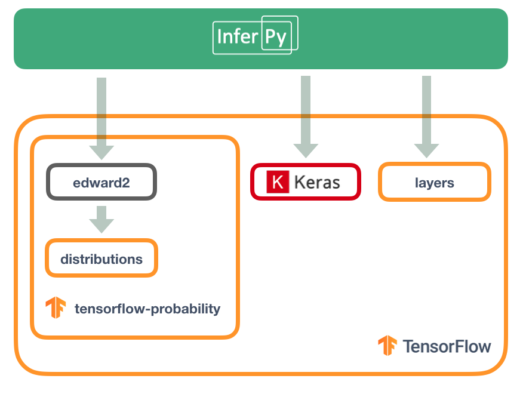

Guiding Principles
==================

Features
~~~~~~~~~~~~

The main features of InferPy are listed below.

-  Allows a simple definition and inference of probabilistic models containing deep neural networks.

-  The models that can be defined in InferPy are those that can be defined using Edward2 (i.e., ``tfp.edward2``, whose probability distribuions
   are mainly inherited from the module ``distributions`` in the tensorflow-probability package.

-  Edward's drawback is that for the model definition, the user has to manage complex multidimensional arrays called
   tensors. By contrast, in InferPy all the parameters in a model can be defined using the standard Python types
   (compatibility with Numpy is available as well).

-  InferPy directly relies on top of Edward's inference engine and
   includes all the inference algorithms included in this package. As
   Edward's inference engine relies on TensorFlow computing engine,
   InferPy also relies on it too.

-  Unlike Edward, our package does not require to have a strong background in the inference methods.

Architecture
~~~~~~~~~~~~~~~

Given the previous considerations, we might summarize the InferPy architecture as follows.

Note that InferPy can be seen as an upper layer for working with probabilistic distributions defined
over tensors. Most of the interaction is done with Edward:  the definitions of the random variables, the
inference. However, InferPy also interacts directly with TensorFlow in some operations that are hidden to
the user, e.g., the manipulation of the tensors representing the parameters of the distributions.

An additional advantage of using Edward and TensorFlow as inference engine, is that all the paralelisation details
are hidden to the user. Moreover, the same code will run either in CPUs or GPUs.

