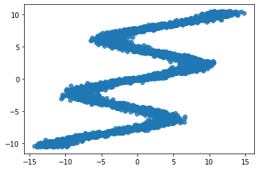
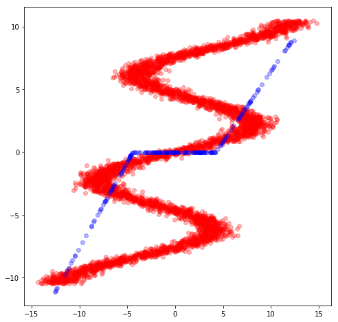
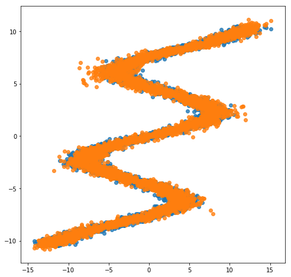

Mixture Density Networks
========================

Mixture density networks (MDN) (Bishop, 1994) are a class of models
obtained by combining a conventional neural network with a mixture
density model.

.. code:: python3

    from __future__ import absolute_import
    from __future__ import division
    from __future__ import print_function
    
    import inferpy as inf
    import matplotlib.pyplot as plt
    import numpy as np
    import seaborn as sns
    import tensorflow as tf
    import tensorflow_probability as tfp
    
    from scipy import stats
    from sklearn.model_selection import train_test_split

.. code:: python3

    def plot_normal_mix(pis, mus, sigmas, ax, label='', comp=True):
        """Plots the mixture of Normal models to axis=ax comp=True plots all
        components of mixture model
        """
        x = np.linspace(-10.5, 10.5, 250)
        final = np.zeros_like(x)
        for i, (weight_mix, mu_mix, sigma_mix) in enumerate(zip(pis, mus, sigmas)):
            temp = stats.norm.pdf(x, mu_mix, sigma_mix) * weight_mix
            final = final + temp
            if comp:
                ax.plot(x, temp, label='Normal ' + str(i))
        ax.plot(x, final, label='Mixture of Normals ' + label)
        ax.legend(fontsize=13)
    
    
    def sample_from_mixture(x, pred_weights, pred_means, pred_std, amount):
        """Draws samples from mixture model.
    
        Returns 2 d array with input X and sample from prediction of mixture model.
        """
        samples = np.zeros((amount, 2))
        n_mix = len(pred_weights[0])
        to_choose_from = np.arange(n_mix)
        for j, (weights, means, std_devs) in enumerate(
                        zip(pred_weights, pred_means, pred_std)):
            index = np.random.choice(to_choose_from, p=weights)
            samples[j, 1] = np.random.normal(means[index], std_devs[index], size=1)
            samples[j, 0] = x[j]
            if j == amount - 1:
                break
        return samples

Data
----

We use the same toy data from `David Ha’s blog
post <http://blog.otoro.net/2015/11/24/mixture-density-networks-with-tensorflow/>`__,
where he explains MDNs. It is an inverse problem where for every input
:math:`x_n` there are multiple outputs :math:`y_n`.

.. code:: python3

    def build_toy_dataset(N):
        y_data = np.random.uniform(-10.5, 10.5, N).astype(np.float32)
        r_data = np.random.normal(size=N).astype(np.float32)    # random noise
        x_data = np.sin(0.75 * y_data) * 7.0 + y_data * 0.5 + r_data * 1.0
        x_data = x_data.reshape((N, 1))
        return x_data, y_data
    
    import random 
    
    tf.random.set_random_seed(42)
    np.random.seed(42)
    random.seed(42)
    
    #inf.setseed(42)
    
    N = 5000    # number of data points
    D = 1    # number of features
    K = 20    # number of mixture components
    
    x_train, y_train = build_toy_dataset(N)

    print("Size of features in training data: {}".format(x_train.shape))
    print("Size of output in training data: {}".format(y_train.shape))
    sns.regplot(x_train, y_train, fit_reg=False)
    plt.show()

.. parsed-literal::

    Size of features in training data: (5000, 1)
    Size of output in training data: (5000,)

Fitting a Neural Network
------------------------

We could try to fit a neural network over this data set. However, for
each x value in this dataset there are multiple y values. So, it poses
problems on the use of standard neural networks.

Let’s first define the neural network. We use ``tf.keras.layers`` to
construct neural networks. We specify a three-layer network with 15
hidden units for each hidden layer.

.. code:: python3

    nnetwork = tf.keras.Sequential([
        tf.keras.layers.Dense(15, activation=tf.nn.relu),
        tf.keras.layers.Dense(15, activation=tf.nn.relu),
        tf.keras.layers.Dense(1, activation=None),
    ])

The following code fits the neural network to the data

.. code:: python3

    lossfunc = lambda y_out, y: tf.nn.l2_loss(y_out-y)
    nnetwork.compile(tf.train.AdamOptimizer(0.1), lossfunc)
    nnetwork.fit(x=x_train, y=y_train, epochs=3000)

.. parsed-literal::

    Epoch 1/3000
    5000/5000 [==============================] - 0s 45us/sample - loss: 386.4314
    Epoch 2/3000
    5000/5000 [==============================] - 0s 24us/sample - loss: 360.6320
	[...]
    Epoch 2997/3000
    5000/5000 [==============================] - 0s 25us/sample - loss: 368.1469
    Epoch 2998/3000
    5000/5000 [==============================] - 0s 23us/sample - loss: 371.1811
    Epoch 2999/3000
    5000/5000 [==============================] - 0s 24us/sample - loss: 371.4650
    Epoch 3000/3000
    5000/5000 [==============================] - 0s 23us/sample - loss: 370.4930

.. parsed-literal::

    <tensorflow.python.keras.callbacks.History at 0x135680198>

.. code:: python3

    sess = tf.keras.backend.get_session()
    x_test, _ = build_toy_dataset(200)
    y_test = sess.run(nnetwork(x_test))

    plt.figure(figsize=(8, 8))
    plt.plot(x_train,y_train,'ro',x_test,y_test,'bo',alpha=0.3)
    plt.show()

It can be seen, the neural network is not able to fit this data.

Mixture Density Network (MDN)
-----------------------------

We use a MDN with a mixture of 20 normal distributions parameterized by
a feedforward network. That is, the membership probabilities and
per-component means and standard deviations are given by the output of a
feedforward network.

We define our probabilistic model using InferPy constructs.
Specifically, we use the ``MixtureGaussian`` distribution, where the the
parameters of this network are provided by the feedforwrad network.

.. code:: python3

    def neural_network(X):
        """loc, scale, logits = NN(x; theta)"""
        # 2 hidden layers with 15 hidden units
        net = tf.keras.layers.Dense(15, activation=tf.nn.relu)(X)
        net = tf.keras.layers.Dense(15, activation=tf.nn.relu)(net)
        locs = tf.keras.layers.Dense(K, activation=None)(net)
        scales = tf.keras.layers.Dense(K, activation=tf.exp)(net)
        logits = tf.keras.layers.Dense(K, activation=None)(net)
        return locs, scales, logits

    @inf.probmodel
    def mdn():
        with inf.datamodel():
            x = inf.Normal(loc = tf.ones([D]), scale = 1.0, name="x")
            locs, scales, logits = neural_network(x)
            y = inf.MixtureGaussian(locs, scales, logits=logits, name="y")

    m = mdn()

Note that we use the ``MixtureGaussian`` random variable. It collapses
out the membership assignments for each data point and makes the model
differentiable with respect to all its parameters. It takes a list as
input—denoting the probability or logits for each cluster assignment—as
well as ``components``, which are lists of loc and scale values.

For more background on MDNs, take a look at `Christopher Bonnett’s blog
post <http://cbonnett.github.io/MDN.html>`__ or at Bishop (1994).

Inference
---------

Next we train the MDN model. For details, see the documentation about
`Inference in
Inferpy <https://inferpy.readthedocs.io/projects/develop/en/develop/notes/guideinference.html>`__

.. code:: python3

    @inf.probmodel
    def qmodel():
            return;

    VI = inf.inference.VI(qmodel(), epochs=4000)
    m.fit({"y": y_train, "x":x_train}, VI)

.. parsed-literal::

     0 epochs	 129578.296875....................
     200 epochs	 113866.8046875....................
     400 epochs	 110405.765625....................
     600 epochs	 108311.9296875....................
     800 epochs	 107741.84375....................
     1000 epochs	 106996.3359375....................
     1200 epochs	 106747.328125....................
     1400 epochs	 106299.640625....................
     1600 epochs	 106157.328125....................
     1800 epochs	 106087.8125....................
     2000 epochs	 106019.1875....................
     2200 epochs	 105955.0703125....................
     2400 epochs	 105751.9765625....................
     2600 epochs	 105717.4609375....................
     2800 epochs	 105693.375....................
     3000 epochs	 105676.3984375....................
     3200 epochs	 105664.40625....................
     3400 epochs	 105655.578125....................
     3600 epochs	 105648.265625....................
     3800 epochs	 105639.09375....................

After training, we can now see how the same network embbeded in a
mixture model is able to perfectly capture the training data.

.. code:: python3

    X_test, y_test = build_toy_dataset(N)
    y_pred = m.posterior_predictive(["y"], data = {"x": X_test}).sample()

    plt.figure(figsize=(8, 8))
    sns.regplot(X_test, y_test, fit_reg=False)
    sns.regplot(X_test, y_pred, fit_reg=False)
    plt.show()

Acknowledgments
---------------

This tutorial is inspired by `David Ha’s blog
post <http://blog.otoro.net/2015/11/24/mixture-density-networks-with-tensorflow/>`__
and `Edward’s
tutorial <http://edwardlib.org/tutorials/mixture-density-network>`__.
