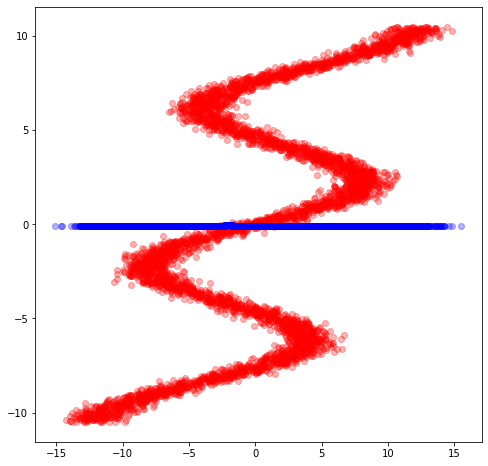
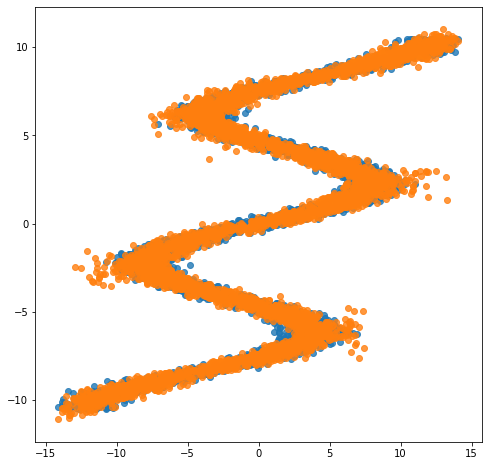

Mixture Density Networks
========================

Mixture density networks (MDN) (Bishop, 1994) are a class of models
obtained by combining a conventional neural network with a mixture
density model.

.. code:: python3

    from __future__ import absolute_import
    from __future__ import division
    from __future__ import print_function
    
    import inferpy as inf
    import matplotlib.pyplot as plt
    import numpy as np
    import seaborn as sns
    import tensorflow as tf
    import tensorflow_probability as tfp
    
    from scipy import stats
    from sklearn.model_selection import train_test_split

.. code:: python3

    def plot_normal_mix(pis, mus, sigmas, ax, label='', comp=True):
        """Plots the mixture of Normal models to axis=ax comp=True plots all
        components of mixture model
        """
        x = np.linspace(-10.5, 10.5, 250)
        final = np.zeros_like(x)
        for i, (weight_mix, mu_mix, sigma_mix) in enumerate(zip(pis, mus, sigmas)):
            temp = stats.norm.pdf(x, mu_mix, sigma_mix) * weight_mix
            final = final + temp
            if comp:
                ax.plot(x, temp, label='Normal ' + str(i))
        ax.plot(x, final, label='Mixture of Normals ' + label)
        ax.legend(fontsize=13)
    
    
    def sample_from_mixture(x, pred_weights, pred_means, pred_std, amount):
        """Draws samples from mixture model.
    
        Returns 2 d array with input X and sample from prediction of mixture model.
        """
        samples = np.zeros((amount, 2))
        n_mix = len(pred_weights[0])
        to_choose_from = np.arange(n_mix)
        for j, (weights, means, std_devs) in enumerate(
                        zip(pred_weights, pred_means, pred_std)):
            index = np.random.choice(to_choose_from, p=weights)
            samples[j, 1] = np.random.normal(means[index], std_devs[index], size=1)
            samples[j, 0] = x[j]
            if j == amount - 1:
                break
        return samples

Data
----

We use the same toy data from `David Ha’s blog
post <http://blog.otoro.net/2015/11/24/mixture-density-networks-with-tensorflow/>`__,
where he explains MDNs. It is an inverse problem where for every input
:math:`x_n` there are multiple outputs :math:`y_n`.

.. code:: python3

    def build_toy_dataset(N):
        y_data = np.random.uniform(-10.5, 10.5, N).astype(np.float32)
        r_data = np.random.normal(size=N).astype(np.float32)    # random noise
        x_data = np.sin(0.75 * y_data) * 7.0 + y_data * 0.5 + r_data * 1.0
        x_data = x_data.reshape((N, 1))
        return x_data, y_data
    
    import random 
    
    tf.random.set_random_seed(42)
    np.random.seed(42)
    random.seed(42)
    
    #inf.setseed(42)
    
    N = 5000    # number of data points
    D = 1    # number of features
    K = 20    # number of mixture components
    
    X_train, y_train = build_toy_dataset(N)
    
    
    print("Size of features in training data: {}".format(X_train.shape))
    print("Size of output in training data: {}".format(y_train.shape))
    sns.regplot(X_train, y_train, fit_reg=False)
    plt.show()

.. parsed-literal::

    Size of features in training data: (5000, 1)
    Size of output in training data: (5000,)

.. image:: ../_static/img/notebooks/output_4_1.png

Fitting a Neural Network
------------------------

We could try to fit a neural network over this data set. However, in
this data set for each x value there are multiple y values. So, things
do not work as should be using standard neural networks.

Let’s define first the neural network. We use ``tf.layers`` to construct
neural networks. We specify a three-layer network with 15 hidden units
for each hidden layer.

.. code:: python3

    def neural_network(X):
        # 2 hidden layers with 15 hidden units
        net = tf.layers.dense(X, 15, activation=tf.nn.relu)
        net = tf.layers.dense(net, 15, activation=tf.nn.relu)
        out = tf.layers.dense(net, 1, activation=None)
        return out

Let’s now try to fit the neural network to the data

.. code:: python3

    x = tf.placeholder(dtype=tf.float32, shape=[None,1])
    y = tf.placeholder(dtype=tf.float32, shape=[None])
    
    y_out = neural_network(x)
    
    lossfunc = tf.nn.l2_loss(y_out-y);
    
    train_op = tf.train.AdamOptimizer(learning_rate=0.1).minimize(lossfunc)
    
    sess = tf.InteractiveSession()
    sess.run(tf.initialize_all_variables())
    
    NEPOCH = 100
    for i in range(NEPOCH):
        sess.run(train_op,feed_dict={x: X_train, y: y_train})
        if i%10==0:
                    print(sess.run(lossfunc,feed_dict={x: X_train, y: y_train}))    
    
    X_test, _ = build_toy_dataset(N)          
    y_test = sess.run(y_out,feed_dict={x: X_test})
    
    plt.figure(figsize=(8, 8))
    plt.plot(X_train,y_train,'ro',X_test,y_test,'bo',alpha=0.3)
    plt.show()
    
    sess.close()

.. parsed-literal::

    511227740.0
    462885000.0
    462411170.0
    462349630.0
    462345150.0
    462343040.0
    462340160.0
    462339230.0
    462338560.0
    462338370.0

As can be seen, the neural network is not able to fit this data set

Mixture Density Network (MDN)
-----------------------------

We use a MDN with a mixture of 20 normal distributions parameterized by
a feedforward network. That is, the membership probabilities and
per-component mean and standard deviation are given by the output of a
feedforward network.

We define our probabilistic model using ``Inferpy`` constructs.
Specifically, we use the ``MixtureGaussian`` distribution, where the the
parameters of this network are provided by our feedforwrad network.

.. code:: python3

    def neural_network(X):
        """loc, scale, logits = NN(x; theta)"""
        # 2 hidden layers with 15 hidden units
        net = tf.layers.dense(X, 15, activation=tf.nn.relu)
        net = tf.layers.dense(net, 15, activation=tf.nn.relu)
        locs = tf.layers.dense(net, K, activation=None)
        scales = tf.layers.dense(net, K, activation=tf.exp)
        logits = tf.layers.dense(net, K, activation=None)
        return locs, scales, logits
    
    
    @inf.probmodel
    def mdn():
        with inf.datamodel():
            x = inf.Normal(loc = tf.ones([D]), scale = 1.0, name="x")
            locs, scales, logits = neural_network(x)
            y = inf.MixtureGaussian(locs, scales, logits=logits, name="y")
        
    m = mdn()

.. parsed-literal::

    W0919 11:50:07.330360 4464960960 deprecation_wrapper.py:119] From /Users/rcabanas/GoogleDrive/UAL/inferpy/repo/InferPy/inferpy/models/prob_model.py:63: The name tf.Session is deprecated. Please use tf.compat.v1.Session instead.
    
    W0919 11:50:07.337288 4464960960 deprecation_wrapper.py:119] From /Users/rcabanas/GoogleDrive/UAL/inferpy/repo/InferPy/inferpy/util/tf_graph.py:63: The name tf.get_default_graph is deprecated. Please use tf.compat.v1.get_default_graph instead.
    
    W0919 11:50:07.348773 4464960960 deprecation_wrapper.py:119] From /Users/rcabanas/GoogleDrive/UAL/inferpy/repo/InferPy/inferpy/models/random_variable.py:425: The name tf.variables_initializer is deprecated. Please use tf.compat.v1.variables_initializer instead.
    
    W0919 11:50:07.543315 4464960960 deprecation.py:323] From /Users/rcabanas/venv/InferPy/lib/python3.6/site-packages/tensorflow_probability/python/internal/distribution_util.py:493: add_dispatch_support.<locals>.wrapper (from tensorflow.python.ops.array_ops) is deprecated and will be removed in a future version.
    Instructions for updating:
    Use tf.where in 2.0, which has the same broadcast rule as np.where
    W0919 11:50:07.578544 4464960960 deprecation_wrapper.py:119] From /Users/rcabanas/GoogleDrive/UAL/inferpy/repo/InferPy/inferpy/models/prob_model.py:136: The name tf.global_variables is deprecated. Please use tf.compat.v1.global_variables instead.
    

Note that we use the ``MixtureGaussian`` random variable. It collapses
out the membership assignments for each data point and makes the model
differentiable with respect to all its parameters. It takes a list as
input—denoting the probability or logits for each cluster assignment—as
well as ``components``, which are lists of loc and scale values.

For more background on MDNs, take a look at `Christopher Bonnett’s blog
post <http://cbonnett.github.io/MDN.html>`__ or at Bishop (1994).

Inference
---------

We train the MDN model. For details, see the documentation about
`Inference in
Inferpy <https://inferpy.readthedocs.io/projects/develop/en/develop/notes/guideinference.html>`__

.. code:: python3

    @inf.probmodel
    def qmodel():
            return;
    
    VI = inf.inference.VI(qmodel(), epochs=3000)
    m.fit({"y": y_train, "x":X_train}, VI)

.. parsed-literal::

    W0919 11:50:07.894652 4464960960 deprecation_wrapper.py:119] From /Users/rcabanas/GoogleDrive/UAL/inferpy/repo/InferPy/inferpy/inference/variational/vi.py:51: The name tf.train.AdamOptimizer is deprecated. Please use tf.compat.v1.train.AdamOptimizer instead.
    
    W0919 11:50:07.924045 4464960960 deprecation.py:323] From /Users/rcabanas/GoogleDrive/UAL/inferpy/repo/InferPy/inferpy/util/interceptor.py:21: Variable.load (from tensorflow.python.ops.variables) is deprecated and will be removed in a future version.
    Instructions for updating:
    Prefer Variable.assign which has equivalent behavior in 2.X.

.. parsed-literal::

    
     0 epochs	 125121.9140625....................
     200 epochs	 114063.9609375....................
     400 epochs	 111963.1171875....................
     600 epochs	 109600.671875....................
     800 epochs	 108434.875....................
     1000 epochs	 107184.3828125....................
     1200 epochs	 106577.9140625....................
     1400 epochs	 106209.484375....................
     1600 epochs	 106260.375....................
     1800 epochs	 106086.125....................
     2000 epochs	 105912.421875....................
     2200 epochs	 105781.296875....................
     2400 epochs	 105735.8828125....................
     2600 epochs	 105708.6796875....................
     2800 epochs	 105689.4765625....................

After training, we can now see how the same network embbeded in a
mixture model is able to perfectly capture the training data.

.. code:: python3

    X_test, y_test = build_toy_dataset(N)
    y_pred = m.posterior_predictive(["y"], data = {"x": X_test}).sample()
    
    plt.figure(figsize=(8, 8))
    sns.regplot(X_test, y_test, fit_reg=False)
    sns.regplot(X_test, y_pred, fit_reg=False)
    plt.show()

Acknowledgments
---------------

This tutorial is inspired by `David Ha’s blog
post <http://blog.otoro.net/2015/11/24/mixture-density-networks-with-tensorflow/>`__
and `Edward’s
tutorial <http://edwardlib.org/tutorials/mixture-density-network>`__.
