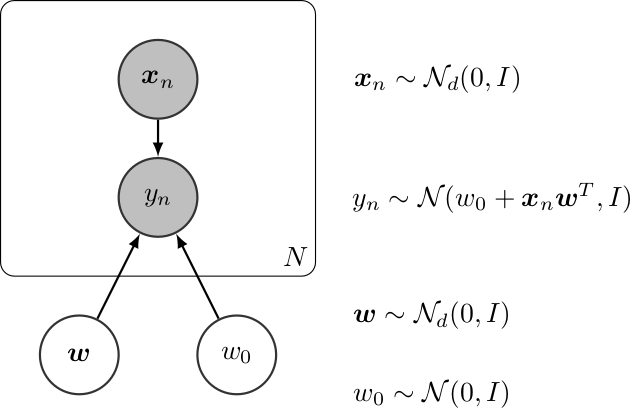
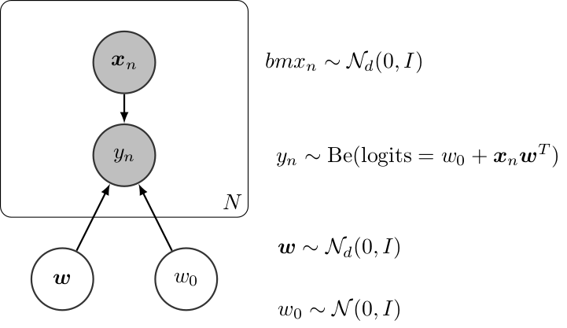
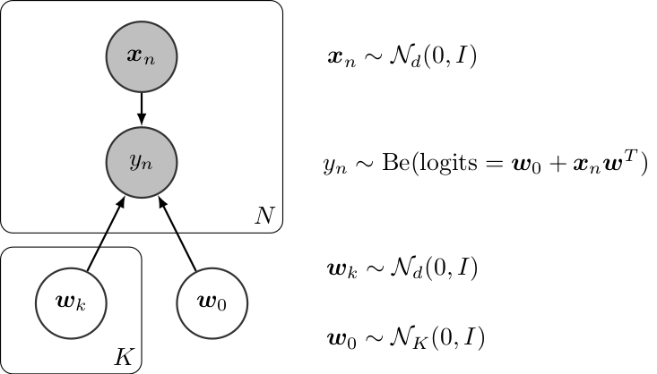
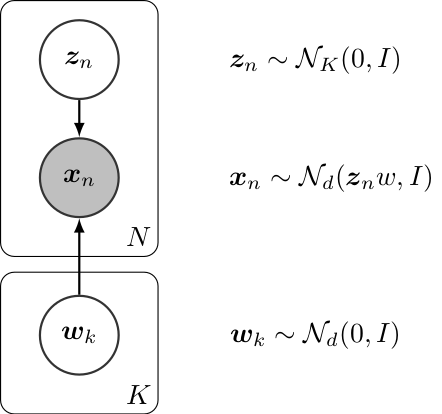
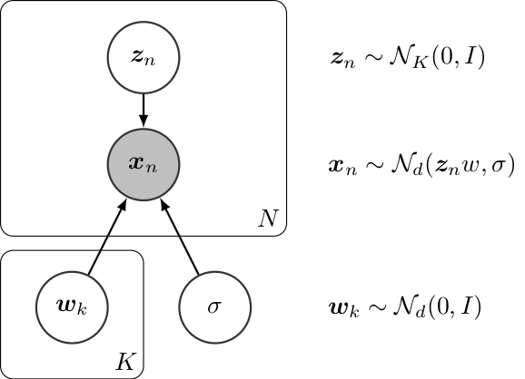

.. _proobzoo:

Probabilistic Model Zoo
===========================

In this section, we present the code for implementing some models in Inferpy. The corresponding code
in Edward can be found in the  `Inferpy vs Edward <inf_vs_ed.html>`_ section.

Bayesian Linear Regression
-----------------------------------

Graphically, a (Bayesian) linear regression can be defined as follows,

   Bayesian Linear Regression

The InferPy code for this model is shown below,

.. literalinclude:: ../../examples/probzoo/linear_regression.py
   :language: python

--------------

Bayesian Logistic Regression
------------------------------------

Graphically, a (Bayesian) logistic regression can be defined as follows,

   Bayesian Linear Regression

The InferPy code for this model is shown below,

.. literalinclude:: ../../examples/probzoo/log_regression.py
   :language: python

--------------

Bayesian Multinomial Logistic Regression
-----------------------------------------------

Graphically, a (Bayesian) multinomial logistic regression can be defined as follows,

   Bayesian Linear Regression

The InferPy code for this model is shown below,

.. literalinclude:: ../../examples/probzoo/multinomial_log_regression.py
   :language: python

--------------

Mixture of Gaussians
--------------------------

Graphically, a Mixture of Gaussians can be defined as follows,

.. figure:: ../_static/img/MoG.png
   :alt: Mixture of Gaussians
   :scale: 100 %
   :align: center

   Bayesian Linear Regression

The InferPy code for this model is shown below,

.. literalinclude:: ../../examples/probzoo/gaussian_mixture.py
   :language: python

--------------

Linear Factor Model (PCA)
-------------------------

A linear factor model allows to perform principal component analysis (PCA). Graphically,
 it can be defined as follows,

   Linear Factor Model (PCA)

The InferPy code for this model is shown below,

.. literalinclude:: ../../examples/probzoo/pca.py
   :language: python

--------------

PCA with ARD Prior (PCA)
------------------------

Similarly to the previous model, the PCA with ARD Prior can be graphically defined as follows,

   PCA with ARD Prior

Its code in InferPy is shown below,

.. literalinclude:: ../../examples/probzoo/pca_with_ARD_prior.py
   :language: python

