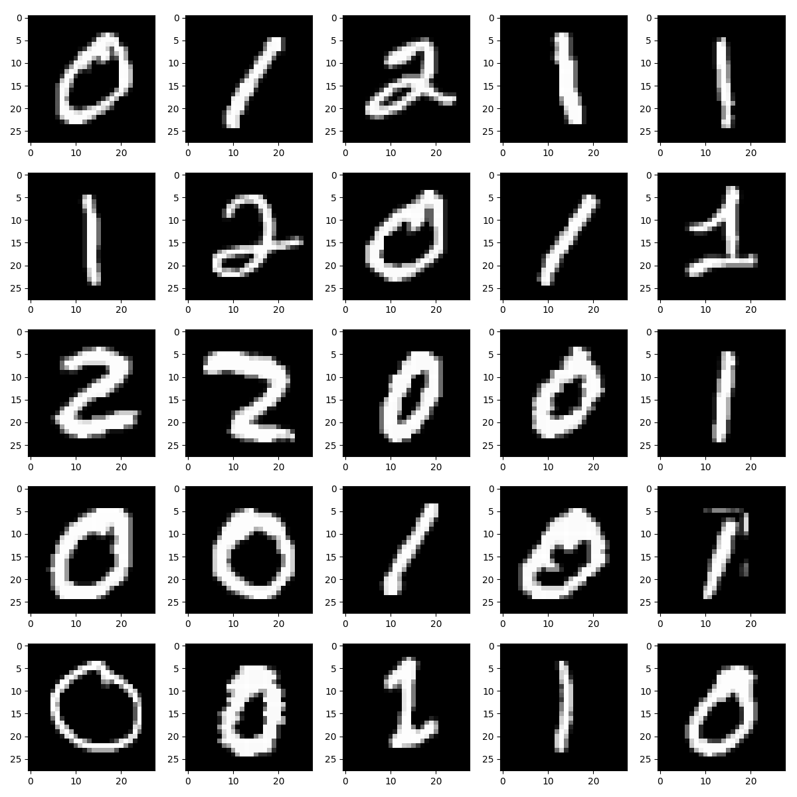
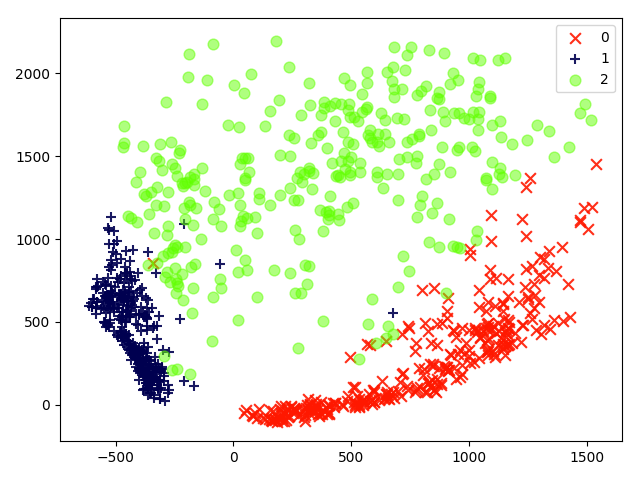
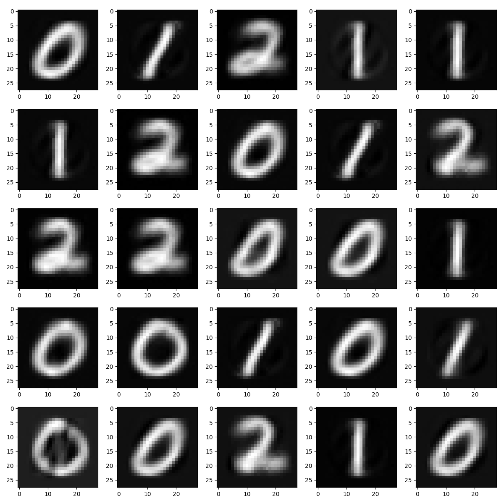

Variational auto-encoder (VAE) in Edward and Inferpy
===========================================================

Here we make a comparison between tensorflow-probability/Edward 2 and InferPy. As a running example, we will consider
a variational auto-encoder (VAE) trained with the MNIST dataset containing handwritten digits. For the inference, SVI method
will be used.

Setting up
-------------

First, we import the required packages and set the global variables. This code is common for both, Edward and InferPy:

.. literalinclude:: ../../examples/edward/ed_vae_mnist.py
   :language: python3
   :lines: 1-26

Then, we can load and plot the MNIST dataset using the functionality provided by ``inferpy.data.mnist``.

.. literalinclude:: ../../examples/probzoo/vae_mnist.py
   :language: python3
   :lines: 30-35

The generated plot is shown in the figure below.

Model definition
--------------------

P and Q models are defined as functions creating random variables. In the case of the VAE model, we must also
define the neural networks for encoding and decoding. For simplicity, these are also defined in functions. The model
definition using Edward is shown below.

.. literalinclude:: ../../examples/edward/ed_vae_mnist.py
   :language: python3
   :lines: 41-63
   :caption: Edward

The equivalent code using InferPy is:

.. literalinclude:: ../../examples/probzoo/vae_mnist.py
   :language: python3
   :lines: 41-66
   :caption: Inferpy

The most relevant difference is that with InferPy we do not need to specify which is the size of the data (i.e., plateau or
datamodel construct). Instead, this will be automatically obtained at inference time.

In both cases, models are defined as functions, though InferPy requires to use the decorator ``@inf.probmodel``. On the
other hand, even though  neural networks can be the same, in the Edward code these are defined with a name as this
will be later used for access to the learned weights.

Inference
---------------

Setting up the inference and batched data
^^^^^^^^^^^^^^^^^^^^^^^^^^^^^^^^^^^^^^^^^^^^^

Before optimizing the variational parameters, we must: split the data into batches; create the instances of the P and Q
models; and finally build tensor for computing **ELBO**, which represents the function that will be optimized.

.. literalinclude:: ../../examples/edward/ed_vae_mnist.py
   :language: python3
   :lines: 89-104
   :caption: Edward

The equivalent code using InferPy is much more simple, as most of such functionality is done transparently to the user:
we simply instantiate the P and Q models and the corresponding inference algorithm. For the running example, this is
done as follows.

.. literalinclude:: ../../examples/probzoo/vae_mnist.py
   :language: python3
   :lines: 78-82
   :caption: Inferpy

Optimization loop
^^^^^^^^^^^^^^^^^^^^^^^

In variational inference, parameters are iteratively optimized. When using Edward, we must first specify TensorFlow optimizers
and training objects. Then the loop is explicitly coded as follows.

.. literalinclude:: ../../examples/edward/ed_vae_mnist.py
   :language: python3
   :lines: 112-127
   :caption: Edward

With InferPy, we simply invoke the method ``probmodel.fit()`` which takes as input parameters the data and the inference
algorithm object previously defined.

.. literalinclude:: ../../examples/probzoo/vae_mnist.py
   :language: python3
   :lines: 88-89
   :caption: Inferpy

Usage of the inferred model
----------------------------------

Once optimization is finished, we can use the model with the inferred parameters. For example, we
might obtain the hidden representation of the original data, which is done by passing such data through the decoder.
Edward does not provide any functionality for this purpose, so we will use TensorFlow code:

.. literalinclude:: ../../examples/edward/ed_vae_mnist.py
   :language: python3
   :lines: 137-149
   :caption: Edward

With InferPy, this is done by simply using the method ``probmodel.posterior()`` as follows.

.. literalinclude:: ../../examples/probzoo/vae_mnist.py
   :language: python3
   :lines: 95-98
   :caption: Inferpy

The result of plotting the hidden representation is:

We might be also interested in generating new digits, which implies passing some data in the hidden space
through the decoder. With Edward, this will be done as follows.

.. literalinclude:: ../../examples/edward/ed_vae_mnist.py
   :language: python3
   :lines: 177-188
   :caption: Edward

Analogously, using InferPy we must just invoke the method ``probmodel.posterior_predictive()``.

.. literalinclude:: ../../examples/probzoo/vae_mnist.py
   :language: python3
   :lines: 120-121
   :caption: Inferpy

Some of the resulting images are shown below.

